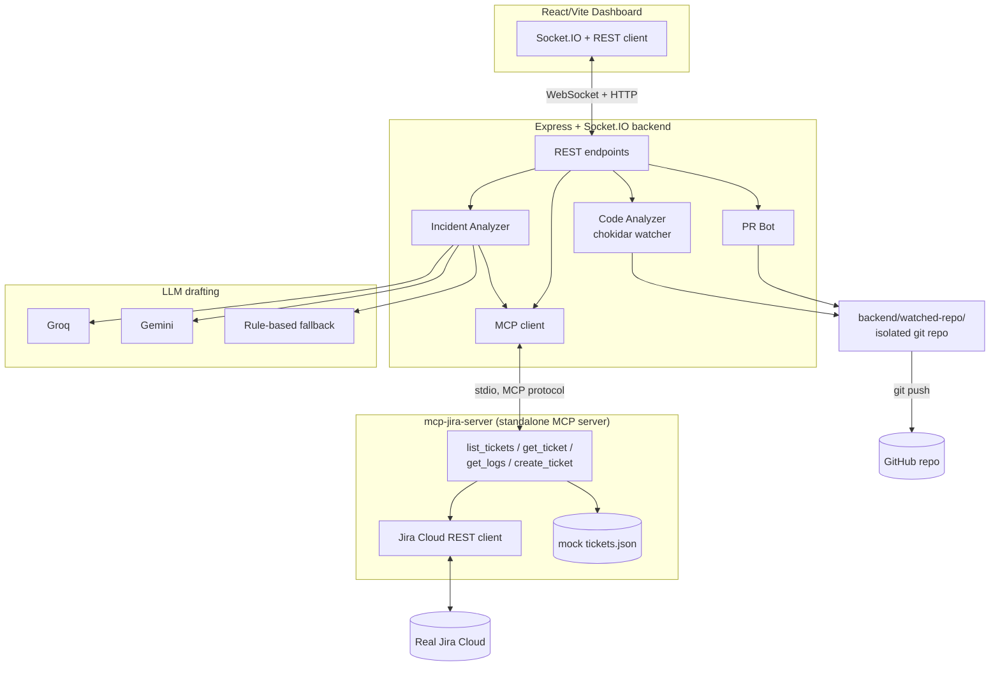
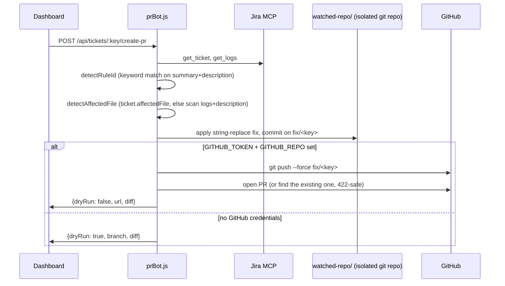
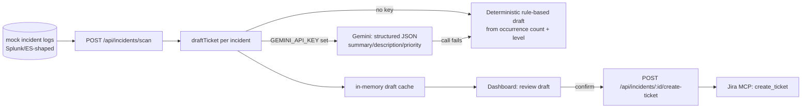

# DevSecOps Copilot — Architecture & Implementation

This document covers the application itself in depth: what each piece does,
how they connect, and why they're built the way they are. For "how do I run
this," see [README.md](README.md) instead — this is the deeper writeup, up
through the log-incident-to-Jira pipeline (deployment infrastructure is
intentionally out of scope here).

## 1. Problem and goals

Security and reliability work usually gets stuck in three disconnected
places: log/monitoring tools that surface an incident, Jira where it gets
tracked, and the codebase where it actually gets fixed. Someone has to
manually shuttle information between all three — read the logs, write up a
ticket, find the offending code, fix it, open a PR that references the
ticket.

DevSecOps Copilot automates that hand-off in both directions:

- **Code → Jira → PR**: a known vulnerability pattern is caught in code, a
  human reviews the correlated Jira ticket, and a fix PR is generated
  automatically.
- **Logs → LLM → Jira**: a production incident is detected from logs, an LLM
  drafts the ticket a human would have written, and — after review — it's
  filed for reference/triage.

Everything is built to run with **zero external configuration** (mock data,
rule-based fallbacks) and to **layer in real services incrementally**
(real Jira, real GitHub, real LLM) without changing how the app is used.

## 2. System overview



Four pieces, one backend process:

1. **Jira MCP server** (`mcp-jira-server/`) — a real, standalone
   [MCP](https://modelcontextprotocol.io) server. The backend talks to it
   over stdio using the MCP SDK, but it's not backend-specific: it can be
   added to Claude Code/Desktop directly (`claude mcp add jira-mock -- node
   mcp-jira-server/index.js`).
2. **Real-time code analyzer** (`backend/modules/codeAnalyzer.js`) — watches
   a directory and flags security anti-patterns as files change.
3. **Automated PR bot** (`backend/modules/prBot.js`) — turns a Jira ticket
   into a code fix and a PR.
4. **Log-incident-to-Jira pipeline** (`backend/modules/incidentAnalyzer.js`,
   `backend/modules/geminiClient.js`) — turns raw error logs into a
   human-reviewed Jira ticket.

## 3. Component deep-dives

### 3.1 Jira MCP server

**Files:** `mcp-jira-server/index.js`, `jiraClient.js`, `adf.js`

Exposes four MCP tools: `list_tickets`, `get_ticket`, `get_logs`,
`create_ticket`. Every tool has two implementations selected at runtime:

```js
// mcp-jira-server/jiraClient.js
export function isRealJiraConfigured() {
  return Boolean(
    process.env.JIRA_BASE_URL && process.env.JIRA_EMAIL &&
    process.env.JIRA_API_TOKEN && process.env.JIRA_PROJECT_KEY
  );
}
```

If all four are set, every tool call hits Jira Cloud's REST API v3
(`GET/POST /rest/api/3/...`, Basic Auth with email + API token). Otherwise
it reads from `mcp-jira-server/data/tickets.json` — three mock tickets
(SEC-101/102/103) shaped identically to what the real API would return, so
the rest of the app can't tell the difference.

**Why this matters for a demo:** the whole app is fully functional and
demoable with zero Jira account, and switching to a real project is just
four environment variables — no code path changes.

**ADF conversion.** Jira Cloud's v3 API returns descriptions and comments as
[Atlassian Document Format](https://developer.atlassian.com/cloud/jira/platform/apis/document/structure/)
— a JSON node tree, not a string. `adf.js` implements a minimal converter
each direction:

- `adfToText(doc)` — walks the tree, joining paragraphs/text/hardBreak/
  codeBlock nodes into plain text for display.
- `textToAdf(text)` — the inverse, needed because *creating* an issue via
  the API requires a description in ADF, not a plain string. Splits on blank
  lines for paragraphs, single newlines within a paragraph become
  `hardBreak` nodes.

**Correlating a ticket to a specific file.** The PR bot (3.3) needs to know
which file in `watched-repo/` a ticket is about. The mock tickets carry an
explicit `affectedFile` field; real Jira tickets don't have that field, so
`get_logs` fetches the ticket's **file attachments**, keeps only text-like
ones (`.log`/`.txt`/`.json`/etc.), downloads their content, and returns it
as `{ source, stacktrace, raw }` — the same shape as the mock data's `logs`
object. Downstream code doesn't need to know whether that text came from a
real attachment or a mock JSON field.

**Defensive parsing.** Two bugs surfaced only against a real Jira site and
are worth calling out because they'd be easy to reintroduce:

- `JIRA_BASE_URL` is normalized to just its origin (`new URL(raw).origin`)
  because a value copied from the browser address bar post-login
  (`https://x.atlassian.net?continue=...&atlOrigin=...`) silently swallows
  any path appended after it — the API path ends up inside the query
  string, and Jira serves back its human-facing login page (200 OK, HTML)
  instead of an error.
- `jiraFetch()` checks `content-type`, not just HTTP status, before parsing
  JSON — a 200 response with an HTML body (exactly the scenario above)
  looks "successful" by status code alone.

### 3.2 Real-time code analyzer

**File:** `backend/modules/codeAnalyzer.js`

A `chokidar` watcher over `backend/watched-repo/`. On every file add/change,
it runs a small set of regex rules against the file's lines:

| Rule | Severity | Catches |
|---|---|---|
| `hardcoded-secret` | critical | `apiKey`/`secret`/`password`/`token` assigned a literal string |
| `eval-usage` | high | `eval(...)` |
| `sql-string-concat` | high | `SELECT/INSERT/UPDATE/DELETE` built via string `+` concatenation |
| `insecure-random` | medium | `Math.random()` |
| `console-sensitive-log` | low | `console.log` of something that looks like a secret |

Findings are pushed to the frontend over Socket.IO (`code:finding`) as they
happen, and a full snapshot is sent to newly-connecting clients
(`code:snapshot`) — so the dashboard is always current without polling.

The three demo files in `watched-repo/` (`paymentService.js`,
`templateRenderer.js`, `userSearch.js`) each contain exactly one seeded
vulnerability matching one of the three "fixable" rules above, so the
analyzer finds them unprompted the moment the backend starts.

### 3.3 Automated PR bot

**File:** `backend/modules/prBot.js`

Given a ticket key, this is the pipeline:



**Rule detection** (`detectRuleId`) is a keyword match over the ticket's
summary + description — "hardcoded"/"api key"/"secret" → `hardcoded-secret`,
"eval("/"rce"/"code execution" → `eval-usage`, "sql injection" →
`sql-string-concat`. Deliberately simple: this is a demo correlating 3 known
patterns, not a general-purpose classifier.

**Fixers** are targeted string replacements per rule (`fixHardcodedSecret`,
`fixEvalUsage`, `fixSqlConcat`) — e.g. swapping a literal secret for
`process.env.STRIPE_API_KEY` and scrubbing it from a log line. They're
exact-match replacements against the specific known demo files, not a
general code-rewriting engine.

**The isolated-repo bug.** `watched-repo/` is supposed to be its own git
repo, entirely separate from the app's own repo, so the bot's commits/pushes
never touch the app's real history. The original implementation checked
this with `simpleGit(REPO_DIR).checkIsRepo()` — which walks up parent
directories, so it returned `true` even with no `.git` inside
`watched-repo/` at all, because it was detecting the **outer app repo**.
Every git operation (checkout, commit, and — once a GitHub token was
configured — remote reconfiguration and force-push) was silently running
against the real project repo. The fix checks for `watched-repo/.git`
directly via `existsSync`, which correctly forces the outer/nested
distinction regardless of directory nesting. Caught by inspecting `git
branch -a`/`git reflog` on the outer repo after testing and finding a stray
branch that was never supposed to exist there.

**Real GitHub PR mode.** With `GITHUB_TOKEN`/`GITHUB_REPO` set, the bot:
- Configures `origin` pointing at a **dedicated** repo (never this app's own
  repo — it force-resets to that repo's `main` and force-pushes `fix/*`
  branches, which would be destructive against a repo with unrelated
  history).
- On a brand-new empty target repo, seeds `main` with the local demo files
  automatically (fetch fails → push local `main` instead).
- Always deletes and recreates the local `fix/<key>` branch fresh from
  current `main` before committing, rather than reusing a stale branch from
  an earlier run in the same process.
- Retries the push once on transient `index-pack failed` transfer errors,
  and forces `http.version = HTTP/1.1` for this repo's git operations — a
  known workaround for git-over-HTTPS corruption on some egress paths.
- Treats "PR already exists" (422 from GitHub) as success — looks up and
  returns the existing open PR instead of erroring, so re-clicking the
  button is idempotent.

### 3.4 Log-incident-to-Jira-ticket pipeline

**Files:** `backend/modules/incidentAnalyzer.js`, `geminiClient.js`,
`backend/data/mockLogs.json`

The inverse direction: instead of starting from a ticket, it starts from
**raw log/incident data** (shaped like aggregated Splunk/Elasticsearch
search results — service, error code, level, occurrence count, first/last
seen, a sample log line) and drafts a ticket a human would review before
it's created.



**Human-in-the-loop by design.** Scanning never creates anything by itself —
it only populates a preview. A ticket is only actually created when the
user clicks "Create Jira ticket" for a specific incident, which looks up the
cached draft by ID and calls the MCP server's `create_ticket` tool. This
mirrors the PR bot's dry-run pattern: automation drafts, a human confirms.

**Graceful LLM degradation.** `draftTicket(incident)` tries Gemini only if
`GEMINI_API_KEY` is set; on any failure (bad key, rate limit, network) it
falls back to a deterministic draft built from the incident's own fields
(occurrence count and log level map to a priority; the sample log becomes
the evidence block) and tags the result with `draftedBy: "rules"` plus the
underlying error, so the frontend can show *why* it fell back rather than
silently substituting different-looking output.

**Why Gemini uses `responseSchema`, not free-form prompting for JSON:**
Gemini's `generationConfig.responseMimeType: "application/json"` +
`responseSchema` constrains the model's output to a fixed shape (`summary`,
`description`, `priority` enum) — more reliable than asking for JSON in the
prompt text and hoping the model doesn't wrap it in prose or markdown
fences.

## 4. Frontend dashboard

**File:** `frontend/src/App.jsx` (single-file React app, Vite build)

Four live panels wired to the backend over Socket.IO + REST:

- **Jira Tickets** — `list_tickets` result; click one to fetch full detail.
- **Ticket Detail** — description/comments/logs, plus the "Auto-fix & open
  PR" button and its dry-run/live result.
- **Live Code Findings** — real-time `code:finding` socket events, grouped
  by file, sorted by worst severity.
- **PR Activity** — every `pr:created` event, dry-run or live.
- **Log Incidents** — the scan/review/confirm flow from 3.4.

**A defensive-coding lesson worth keeping.** Early on, any backend API error
turned the whole dashboard permanently blank with zero visible error. Root
cause: the tickets fetch never checked `response.ok` before calling
`setTickets(body)` — an error response shaped `{error: "..."}` got set as
ticket state directly, and a later unconditional `tickets.filter(...)`
threw `TypeError: e.filter is not a function`. With no error boundary,
React silently unmounted the entire tree. The fix (check `r.ok`, verify the
body is actually an array before using it as one) seems obvious in
hindsight, but the *symptom* — a blank page with no console output — looked
exactly like a browser extension conflict or a completely broken
deployment, and took real effort to trace back to "any transient backend
hiccup crashes the UI." Verified by pointing a local build at a mock
500-returning server and confirming the connection-error banner now shows
instead of a blank screen.

## 5. Two end-to-end walkthroughs

**Code vulnerability → fix PR:**
1. Backend starts, `codeAnalyzer.js` scans `watched-repo/`, finds the
   hardcoded secret in `paymentService.js`, emits it over the socket.
2. Dashboard shows SEC-101 ("Hardcoded Stripe API key...") in the ticket
   list (fetched independently via `list_tickets`) alongside the live
   finding — the two aren't directly linked in code, they just both
   reference the same underlying vulnerability by construction.
3. User clicks SEC-101 → `get_ticket` + `get_logs` fetch the description,
   comment history, and stack-trace evidence.
4. User clicks "Auto-fix & open PR" → `detectRuleId` matches
   "hardcoded"/"api key" → `hardcoded-secret` → `detectAffectedFile` reads
   `paymentService.js` off the ticket → `fixHardcodedSecret` rewrites the
   file → commit on `fix/sec-101` → dry-run preview or real PR.

**Production incident → Jira ticket:**
1. User clicks "Scan for incidents" → `scanForIncidents()` loads
   `mockLogs.json`'s 4 incidents (payment gateway timeout, DB pool
   exhaustion, unhandled exception, disk space warning).
2. Each is drafted via Gemini (if configured) or the rule-based fallback,
   cached, and shown as a card with the incident evidence + drafted
   summary/description/priority.
3. User reviews, clicks "Create Jira ticket" on one → `POST
   /api/incidents/:id/create-ticket` → the cached draft is handed to the
   MCP server's `create_ticket` tool → real Jira issue (or a `MOCK-###` key
   in mock mode) → result broadcast over `incident:ticket-created` so every
   connected client sees it land.

## 6. Design decisions and patterns

A few patterns repeat across all four components, deliberately:

- **Mock-first, real-optional.** Every external dependency (Jira, GitHub,
  the LLM) has a fully-functional mock/fallback path, selected by presence
  of env vars, never by a separate code branch the user has to opt into.
  The app is demoable with literally zero configuration.
- **Human-in-the-loop for anything irreversible.** The PR bot returns a
  dry-run diff by default; the incident pipeline drafts but never
  auto-creates. Both require an explicit confirming click for the
  real-world side effect.
- **Graceful degradation, not hard failure.** Gemini failing falls back to
  rules; a missing attachment falls back to scanning the description; a
  malformed env var (URL with query string, repo as a full URL) gets
  normalized rather than rejected outright — with the underlying error
  still surfaced, not hidden.
- **Idempotent automation.** Re-running the PR bot for the same ticket
  deletes and recreates the local branch fresh and force-pushes, rather
  than erroring on "branch already exists"; an existing open PR is looked
  up and returned rather than treated as a failure.

## 7. Tech stack

| Layer | Tech |
|---|---|
| Backend | Node.js, Express, Socket.IO, `simple-git`, `@octokit/rest`, `chokidar` |
| Jira MCP server | `@modelcontextprotocol/sdk`, `zod`, native `fetch` |
| LLM drafting | Google Gemini (`generateContent` + `responseSchema`) |
| Frontend | React 19, Vite, `socket.io-client` |
| Real Jira integration | Jira Cloud REST API v3, Basic Auth (email + API token) |

## 8. Known limitations

- The PR bot's rule detection and fixers are exact-match/keyword-based,
  scoped to exactly 3 seeded vulnerability patterns in 3 specific files —
  not a general static-analysis or auto-remediation engine.
- Real-Jira file correlation depends on the affected filename literally
  appearing in an attachment or the ticket description; there's no deeper
  code-search correlation.
- The incident pipeline's log source is mock data shaped like
  Splunk/Elasticsearch output; it does not yet query a real log backend.
