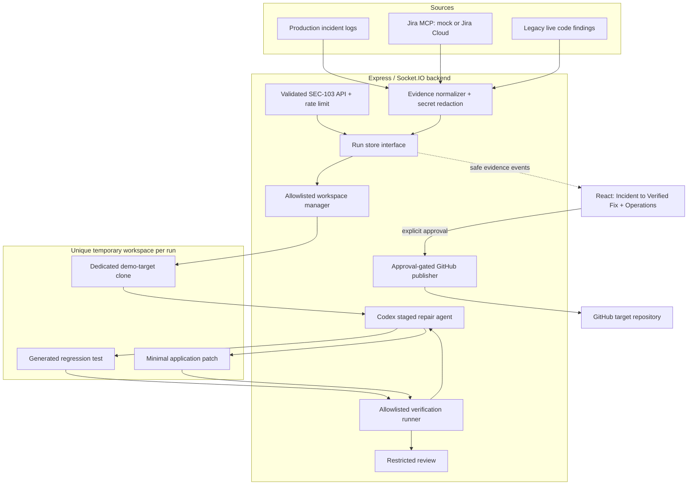
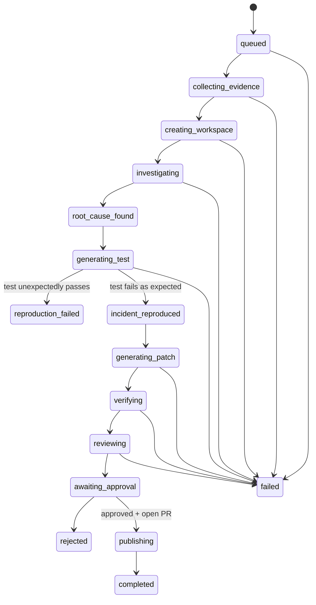

# DevSecOps Copilot architecture

## End-to-end system

## Component responsibilities

| Component | Responsibility |
|---|---|
| `evidenceNormalizer` | Combines ticket, comments, logs, stack trace, malicious input, and findings; removes secret fields and patterns. |
| `demoScenarios` | Defines the one allowed ticket, repository, branch, file, and payload. |
| `workspaceManager` | Makes a unique clone, records `HEAD`, blocks the application repository and path escapes, and cleans up. |
| `codexRepairAgent` | Runs investigation, regression-test generation, patch generation, and restricted review. |
| `verificationRunner` | Uses `spawn` without a shell for only predefined install, test, lint, audit, and Git read commands. |
| `runStore` | Owns serializable state and legal transitions behind a replaceable interface. |
| `codexWorker` | Orchestrates long-running work outside HTTP request/response handling and emits safe product evidence. |
| `githubPublisher` | Commits the verified workspace and opens or previews a PR only after approval. |
| legacy modules | Preserve Jira MCP, scanning, Operations UI, incident drafting, and old PR demo behavior. |

## Run-state model

## Codex stages and data flow

1. Investigation is read-only and receives normalized evidence, repository
   contents, and `AGENTS.md`. Only its concise final result is retained.
2. Test generation may write one focused test but not application code.
   Independent execution must fail or the run stops as `reproduction_failed`.
3. Patch generation may change application code only after reproduction.
4. The backend independently runs the regression test, full suite, lint, audit,
   diff, and status checks.
5. Review receives only evidence, diff, and results. A critical finding blocks
   publication.

Socket.IO sends stage, short message, timestamp, and safe evidence—not prompts,
credentials, raw authentication data, or hidden reasoning.

## Security boundaries

- Browser: selects no repository, prompt, or command; it can start only SEC-103.
- API: validates exact identifiers and rate-limits creation.
- Workspace: one clone per run under a controlled temporary root; no
  `process.chdir()`.
- Model: Codex CLI runs with `read-only` or `workspace-write`, approvals disabled,
  and no web-search/network capability requested.
- Process: fixed executable/argument pairs, `shell: false`, bounded output and
  timeouts.
- Patch: non-empty, at most five changed files and 300 diff lines.
- Publication: only the configured repository and only after approval; Git
  credentials are not written into the remote URL.

## Failure handling

Unexpected pre-patch success becomes `reproduction_failed` and never claims the
incident was reproduced. Failed post-patch tests or lint stop the run. Critical
review findings stop publication. Failed, rejected, deleted, and published
workspaces are removed. Errors are provider-specific and surfaced in both REST
state and the UI. In-memory state is lost on process restart, so active jobs are
not restart-safe.

## Deployment model

The Vite frontend talks to one Express/Socket.IO backend. The backend starts the
Jira MCP server over stdio and creates ephemeral run workspaces on its local
filesystem. The target may be the bundled nested Git repository locally or the
single configured GitHub repository. Production should move runs to isolated
workers with durable PostgreSQL state and a queue; the current Render manifest is
appropriate only for a hackathon demo with ephemeral storage.

## Known limitations

Only SEC-103 is implemented. Saved-demo mode is deliberately labeled and does
not impersonate a live Codex call. Audit/install require npm registry access.
Timeout enforcement kills child commands but is not a full container boundary.
Run expiration cleanup is not yet scheduled, and real GitHub publication assumes
the base repository already contains the target project.
