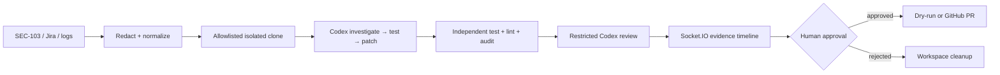

# DevSecOps  Copilot

DevSecOps Copilot uses OpenAI Codex to connect production incidents, Jira
evidence, and source code, then generates a regression test, creates a minimal
patch, verifies the test suite, and opens a human-approved pull request.

## Problem

Production evidence, Jira context, and source code usually live in separate
systems. Engineers manually reproduce incidents, locate the cause, write tests,
patch code, verify it, and assemble a pull request. This project makes that
handoff visible, repeatable, and reviewable.

## Product workflow

```text
SEC-103 / production logs
→ normalized and redacted evidence
→ isolated clone of the allowlisted target
→ Codex investigation
→ Codex regression test
→ proof the vulnerable base fails
→ minimal parameterized-query patch
→ independent tests, lint, audit, and review
→ human approval
→ GitHub pull request or dry-run preview
```

The first polished scenario is `SEC-103`, an SQL-injection incident in
`src/userSearch.js`. Arbitrary tickets, repositories, prompts, and commands are
rejected.

## Why OpenAI Codex is essential

Codex performs the repository-level work that triage models cannot: it reads
`AGENTS.md`, investigates the isolated checkout, generates a focused regression
test before modifying application code, makes a minimal patch, and performs a
restricted review. The backend independently executes the proof and verification
commands; it never stores hidden reasoning.

`CODEX_MODE=cli` enables live Codex CLI stages. The default mode is a clearly
labeled, deterministic saved demonstration result so judges can see the complete
workflow without external credentials. Groq or Gemini remain limited to
production-log classification and Jira drafting.

## Live demo

Open the default **Incident to Verified Fix** view and click **Run sample
incident**. The page shows Jira evidence, the failing pre-patch test, exact diff,
passing post-patch verification, independent review, and the approval gate.
Without GitHub credentials, **Approve and open PR** produces the full dry-run PR
body. The existing dashboard remains available under **Operations**.

## Key capabilities

- Jira MCP mock mode and real Jira Cloud support
- Groq → Gemini → deterministic fallback for incident ticket drafting
- Socket.IO evidence events and visible disconnection state
- isolated, concurrent target workspaces with base commit capture
- allowlisted `spawn`-based verification commands
- live Codex CLI mode with network-disabled repair prompts
- explicit reproduction, verification, review, and approval gates
- GitHub dry-run and real pull-request publishing
- legacy code scanner and dashboard preserved

## Architecture



See [ARCHITECTURE.md](ARCHITECTURE.md) for boundaries, states, and failure
handling.

## Three-minute demo

1. Show SEC-103 evidence and the SQL payload in **Incident Summary**.
2. Start the sample and follow the nine-stage timeline.
3. Open the failing regression-test output and explain the reproduction gate.
4. Show the two-file diff and passing independent verification.
5. Show the restricted review and remaining database-driver risk.
6. Approve, then show the dry-run PR body or live GitHub URL.
7. Switch to **Operations** to show Jira MCP, scanning, and incident drafting.

## Local setup

Requires Node.js 20+ and Git.

```bash
cd devsecops-demo-target-main
npm install
npm test
npm run lint
npm run security

cd ../mcp-jira-server
npm install

cd ../backend
npm install
npm test
npm run lint
npm run dev

cd ../frontend
npm install
npm run lint
npm run build
npm run dev
```

The backend listens on `http://localhost:4000`; Vite uses
`http://localhost:5173`.

## Environment variables

| Variable | Required | Purpose |
|---|---:|---|
| `CODEX_MODE=cli` | No | Run live OpenAI Codex stages; default is saved-demo |
| `CODEX_CLI_PATH` | No | Alternate Codex executable |
| `CODEX_TARGET_REPOSITORY` | No | The single allowlisted GitHub target or local target path |
| `CODEX_TARGET_BASE_BRANCH` | No | Base branch, default `main` |
| `GITHUB_TOKEN` / `GITHUB_REPO` | No | Real PR publishing; absent means dry-run |
| `JIRA_BASE_URL`, `JIRA_EMAIL`, `JIRA_API_TOKEN`, `JIRA_PROJECT_KEY` | No | Real Jira; all absent means mock MCP data |
| `JIRA_ISSUE_TYPE` | No | Jira issue type, default `Task` |
| `GROQ_API_KEY` / `GROQ_MODEL` | No | First incident-drafting provider |
| `GEMINI_API_KEY` / `GEMINI_MODEL` | No | Second incident-drafting provider |
| `CORS_ORIGIN` | No | Browser origin |
| `VITE_BACKEND_URL` | No | Frontend backend URL |
| `PORT` | No | Backend port |

Keep every secret server-side. Never use `VITE_` for API keys or tokens.

## Safety and human approval

The backend accepts only SEC-103 and the configured demo target, rate-limits
run creation, clones into a unique temporary directory, never changes process
working directory, invokes only predefined command/argument pairs without a
shell, redacts evidence, limits diff size and file count, and blocks publication
until explicit approval. Git tokens are passed through a temporary Git process
environment rather than persisted in remote URLs. Rejected, failed, deleted, and
published workspaces are cleaned up.

## Limitations

- Only SEC-103 is supported by the new Codex workflow.
- Run storage is in memory and work is queued in-process.
- Saved-demo mode is deterministic evidence, not a live model claim.
- `npm audit` needs registry access.
- Real publishing assumes a GitHub repository whose base contains the demo target.
- Placeholder style (`?`) must match the production database driver.

## Future work

Replace the store with PostgreSQL, move jobs to a durable queue, add expiry
sweeps and stronger OS/container isolation, verify GitHub webhook merge status,
support provider-specific SQL placeholders, and add scenarios only after the
SEC-103 workflow remains fully verified.
