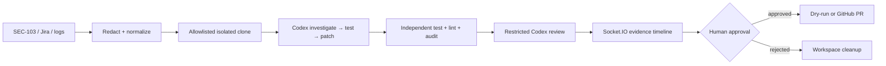

# DevSecOps  Copilot

DevSecOps Copilot uses OpenAI Codex to connect production incidents, Jira
evidence, and source code, then generates a regression test, creates a minimal
patch, verifies the test suite, and opens a human-approved pull request.

## Problem

Production evidence, Jira context, and source code usually live in separate
systems. Engineers manually reproduce incidents, locate the cause, write tests,
patch code, verify it, and assemble a pull request. This project makes that
handoff visible, repeatable, and reviewable.

## Product workflow

```text
SEC-103 / production logs
→ normalized and redacted evidence
→ isolated clone of the allowlisted target
→ Codex investigation
→ Codex regression test
→ proof the vulnerable base fails
→ minimal parameterized-query patch
→ independent tests, lint, audit, and review
→ human approval
→ GitHub pull request or dry-run preview
```

The first polished scenario is `SEC-103`, an SQL-injection incident in
`src/userSearch.js`. Arbitrary tickets, repositories, prompts, and commands are
rejected.

## Why OpenAI Codex is essential

Codex performs the repository-level work that triage models cannot: it reads
`AGENTS.md`, investigates the isolated checkout, generates a focused regression
test before modifying application code, makes a minimal patch, and performs a
restricted review. The backend independently executes the proof and verification
commands; it never stores hidden reasoning.

`CODEX_MODE=cli` enables live Codex CLI stages. The default mode is a clearly
labeled, deterministic saved demonstration result so judges can see the complete
workflow without external credentials. Groq or Gemini remain limited to
production-log classification and Jira drafting.

## Live demo

Open the default **Incident to Verified Fix** view and click **Run sample
incident**. The page shows Jira evidence, the failing pre-patch test, exact diff,
passing post-patch verification, independent review, and the approval gate.
Without GitHub credentials, **Approve and open PR** produces the full dry-run PR
body. The existing dashboard remains available under **Operations**.

## Key capabilities

- Jira MCP mock mode and real Jira Cloud support
- Groq → Gemini → deterministic fallback for incident ticket drafting
- Socket.IO evidence events and visible disconnection state
- isolated, concurrent target workspaces with base commit capture
- allowlisted `spawn`-based verification commands
- live Codex CLI mode with network-disabled repair prompts
- explicit reproduction, verification, review, and approval gates
- GitHub dry-run and real pull-request publishing
- legacy code scanner and dashboard preserved

## Architecture



See [ARCHITECTURE.md](ARCHITECTURE.md) for boundaries, states, and failure
handling.

## Three-minute demo

1. Show SEC-103 evidence and the SQL payload in **Incident Summary**.
2. Start the sample and follow the nine-stage timeline.
3. Open the failing regression-test output and explain the reproduction gate.
4. Show the two-file diff and passing independent verification.
5. Show the restricted review and remaining database-driver risk.
6. Approve, then show the dry-run PR body or live GitHub URL.
7. Switch to **Operations** to show Jira MCP, scanning, and incident drafting.

## Local setup

Requires Node.js 20+ and Git.

```bash
cd devsecops-demo-target-main
npm install
npm test
npm run lint
npm run security

cd ../mcp-jira-server
npm install

cd ../backend
npm install
npm test
npm run lint
npm run dev

cd ../frontend
npm install
npm run lint
npm run build
npm run dev
```

The backend listens on `http://localhost:4000`; Vite uses
`http://localhost:5173`.

## Environment variables

| Variable | Required | Purpose |
|---|---:|---|
| `CODEX_MODE=cli` | No | Run live OpenAI Codex stages; default is saved-demo |
| `CODEX_CLI_PATH` | No | Alternate Codex executable |
| `CODEX_TARGET_REPOSITORY` | No | The single allowlisted GitHub target or local target path |
| `CODEX_TARGET_BASE_BRANCH` | No | Base branch, default `main` |
| `GITHUB_TOKEN` / `GITHUB_REPO` | No | Real PR publishing; absent means dry-run |
| `JIRA_BASE_URL`, `JIRA_EMAIL`, `JIRA_API_TOKEN`, `JIRA_PROJECT_KEY` | No | Real Jira; all absent means mock MCP data |
| `JIRA_ISSUE_TYPE` | No | Jira issue type, default `Task` |
| `GROQ_API_KEY` / `GROQ_MODEL` | No | First incident-drafting provider |
| `GEMINI_API_KEY` / `GEMINI_MODEL` | No | Second incident-drafting provider |
| `CORS_ORIGIN` | No | Browser origin |
| `VITE_BACKEND_URL` | No | Frontend backend URL |
| `PORT` | No | Backend port |

Keep every secret server-side. Never use `VITE_` for API keys or tokens.

## Safety and human approval

The backend accepts only SEC-103 and the configured demo target, rate-limits
run creation, clones into a unique temporary directory, never changes process
working directory, invokes only predefined command/argument pairs without a
shell, redacts evidence, limits diff size and file count, and blocks publication
until explicit approval. Git tokens are passed through a temporary Git process
environment rather than persisted in remote URLs. Rejected, failed, deleted, and
published workspaces are cleaned up.

## Limitations

- Only SEC-103 is supported by the new Codex workflow.
- Run storage is in memory and work is queued in-process.
- Saved-demo mode is deterministic evidence, not a live model claim.
- `npm audit` needs registry access.
- Real publishing assumes a GitHub repository whose base contains the demo target.
- Placeholder style (`?`) must match the production database driver.

Works with zero config (deterministic rule-based ticket drafts from the mock
log data in `backend/data/mockLogs.json`). To have an LLM draft the
summary/description/priority instead:
```bash
export GROQ_API_KEY=...     # console.groq.com — free tier, no card required (tried first)
# or
export GEMINI_API_KEY=...   # aistudio.google.com (note: some Google Cloud-issued
                             # keys need billing enabled even for "free tier" quota)
```
Click **"Scan for incidents"** in the dashboard, review each drafted ticket,
then **"Create Jira ticket"** — this calls the same Jira MCP server (real or
mock, per the config above), so tickets created here show up in your real
Jira project if one is configured.

### Using the Jira MCP server standalone

It's a normal stdio MCP server, so it can be added to any MCP client, e.g.
Claude Code:

```bash
claude mcp add jira-mock -- node /path/to/mcp-jira-server/index.js
```

## Deploying to GCP Cloud Run (Terraform + GitHub Actions)

This is the cost-optimized option: Cloud Run scales to zero when idle, so it
costs nothing between demo sessions, unlike an always-on host.

### One-time setup

1. Install the [gcloud CLI](https://cloud.google.com/sdk/docs/install) and
   run `gcloud auth login` and `gcloud auth application-default login`.
2. Create (or pick) a GCP project and note its project ID. Make sure billing
   is linked (required even to use free-tier quota).
3. ```bash
   cd infra
   cp terraform.tfvars.example terraform.tfvars
   # edit terraform.tfvars: at minimum set project_id and github_repo
   terraform init
   terraform plan    # review what it's about to create
   terraform apply
   ```
   This provisions: Artifact Registry, two Cloud Run services (backend +
   frontend, deployed initially with a placeholder image), Secret Manager
   secrets (placeholder values), and a Workload Identity Federation setup
   scoped to your GitHub repo so Actions can deploy without a stored key.
4. Note the outputs — you'll need `workload_identity_provider` and
   `deployer_service_account_email` for the next step.
5. In your GitHub repo → **Settings → Secrets and variables → Actions →
   Variables** tab, add these repo variables (none of these are secret
   values, they're just config — plain "Variables", not "Secrets"):
   | Name | Value |
   |---|---|
   | `GCP_PROJECT_ID` | your project ID |
   | `GCP_REGION` | e.g. `us-central1` |
   | `GCP_ARTIFACT_REPO` | `devsecops-copilot` (or your `repo_name` var) |
   | `GCP_BACKEND_SERVICE` | `devsecops-backend` |
   | `GCP_FRONTEND_SERVICE` | `devsecops-frontend` |
   | `GCP_WORKLOAD_IDENTITY_PROVIDER` | the `workload_identity_provider` output |
   | `GCP_DEPLOYER_SA_EMAIL` | the `deployer_service_account_email` output |
6. Populate the real secret values (these actually are secrets — set via
   `gcloud`, never through Terraform variables or GitHub Actions logs):
   ```bash
   echo -n "github_pat_xxx" | gcloud secrets versions add github-token --data-file=- --project=YOUR_PROJECT_ID
   echo -n "your-jira-api-token" | gcloud secrets versions add jira-api-token --data-file=- --project=YOUR_PROJECT_ID
   echo -n "your-groq-key" | gcloud secrets versions add groq-api-key --data-file=- --project=YOUR_PROJECT_ID
   ```
7. Push to `main` (or run the workflow manually from the Actions tab) —
   GitHub Actions builds both images, pushes them to Artifact Registry, and
   deploys both Cloud Run services.

### After first deploy

Tighten CORS to the real frontend URL instead of `*`: set `cors_origin` in
`terraform.tfvars` to the `frontend_url` Terraform output, then
`terraform apply` again (or `gcloud run services update devsecops-backend
--set-env-vars CORS_ORIGIN=https://your-frontend-url`).

### Cost notes

- Both services scale to **zero** instances when idle (`min_instance_count = 0`)
  — no compute cost between uses.
- `max_instance_count = 2` on both caps any runaway scaling cost.
- Artifact Registry's cleanup policy keeps only the 5 most recent image
  versions per repo, so storage cost stays flat instead of growing forever.
- Consider setting a [budget alert](https://cloud.google.com/billing/docs/how-to/budgets)
  on the project so you get notified well before the $300 credit runs out.
- When you're done with the hackathon: `cd infra && terraform destroy` tears
  down every resource this created.

## Alternative: Render + Vercel

Simpler to set up manually (no Terraform/Docker), but Render's free tier
sleeps after 15 minutes idle and wakes slowly, and doesn't scale to zero the
way Cloud Run does cost-wise. Push this repo to GitHub, then:
- **Backend** → Render → New Web Service → Build Command
  `npm install --prefix backend && npm install --prefix mcp-jira-server`,
  Start Command `npm --prefix backend start`. Set the same env vars as above
  in Render's Environment tab.
- **Frontend** → Vercel → import the repo with Root Directory `frontend`, set
  `VITE_BACKEND_URL` to the Render URL.

## Demo script for the hackathon

1. Show the three mock Jira tickets (SEC-101 hardcoded key, SEC-102 eval RCE,
   SEC-103 SQL injection) already appearing in **Live Code Findings** —
   the code analyzer found them without being told.
2. Click SEC-101, walk through the description/comments/logs pulled live via
   MCP.
3. Click **Auto-fix & open PR** — show the generated diff and PR body that
   references the ticket and cites the log evidence.
4. Edit `backend/watched-repo/paymentService.js` live to show the findings
   panel update in real time via the socket connection.
5. Scroll to **Log Incidents**, click **Scan for incidents** — show the
   LLM-drafted ticket preview for a production error-log incident, then
   **Create Jira ticket** to show it land in Jira for reference/triage.

## Future work

Replace the store with PostgreSQL, move jobs to a durable queue, add expiry
sweeps and stronger OS/container isolation, verify GitHub webhook merge status,
support provider-specific SQL placeholders, and add scenarios only after the
SEC-103 workflow remains fully verified.
